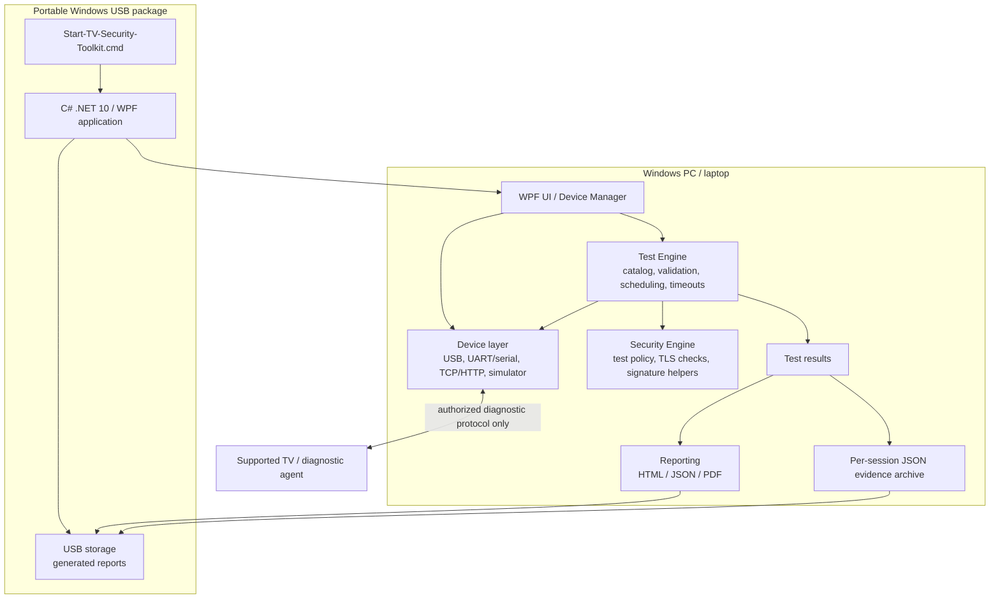

# Architecture

The USB package contains the Windows application and its runtime data. The launcher starts it with the package
directory as the working directory. Package configuration sets `outputDir` to `.`, so generated reports are written
under the package's `reports` folder on the USB drive. Windows does not automatically execute programs on removable
media; the user must open the drive and launch the command file.

Evidence collected during a test is attached to test results, included in generated reports, and automatically
persisted as a per-session JSON archive under `evidence/<session-id>/`. Configured HTML/JSON/PDF reports are also
saved for every completed run under `reports/<session-id>/`; the Reports page can open both output folders.
Structured JSON logs are written under the package's `logs` directory. Log events contain operational metadata and
avoid recording device identity values or diagnostic payloads.

The TV connection is separate from the USB mass-storage connection: the toolkit runs on the PC and communicates with
the TV over a supported USB device interface, UART/serial adapter, or network transport. The USB stick itself is not
assumed to be a TV-readable test agent. Real device support requires a documented, authorized TV diagnostic protocol
and trust/authentication flow; the repository's current protocol remains an assumption until validated for a target.
Until vendor authentication and target protocol conformance are implemented, hardware transports are explicitly
reported as unauthenticated and test execution is blocked. Simulator execution remains available for software
verification.

The Device page also has read-only platform-tool discovery for Android/Google TV (`adb`), Samsung Tizen (`sdb`),
and LG webOS (`ares-device`). It invokes only fixed device-list commands, reports whether a tool is unavailable,
failed, timed out, or returned device information, and does not retain raw command output. These checks do not
authenticate a TV, verify target compatibility, establish a diagnostic protocol, or lift the hardware execution
guard. Platform-specific test support remains gated on vendor specifications and authorized target validation.

For Roku, the Device page can issue a single read-only ECP `/query/device-info` request to an explicitly entered
host on port 8060. The host is validated, redirects are disabled, the XML parser prohibits DTDs and limits document
size, and only an unverified model name is displayed. There is no address-range scan, no write command, and no
change to the hardware test guard.

## Software run flow

Core defines models, interfaces, and constants. The WPF application composes Device, Engine, Security, Reporting, and
the catalog test assemblies.

`TestEngine.RunAsync` -> `TestOrchestrator` -> `TestRunner` (ordered by `TestScheduler`) -> `TestExecutor`
(timeout, exceptions -> Error, cancellation -> Cancelled) -> `TestPipeline` (validate -> compatibility -> policy -> provision -> run) ->
`CatalogTest` -> `TestStepExecutor` (resolve args, call device, `AssertionEngine`). Results become a `SecurityReport`;
the report generators serialize HTML, JSON, and PDF outputs to the configured output directory. The toolkit also
persists per-run evidence and structured operational logs to the USB package. Storage failures are surfaced rather
than represented as successful output. The USB package stores generated files on the same drive, subject to available
space, permissions, write protection, and normal Windows removable-media behavior.
